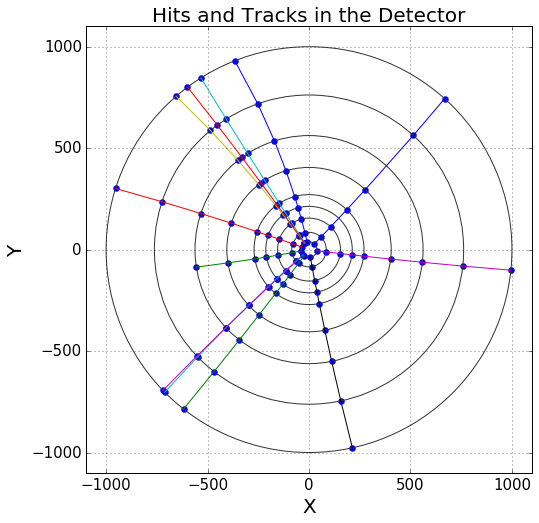

# TrackML2DBaseline

## Introduction

This repository contains several baseline solutions for the TrackML mini challenge. In this challenge a 2D detector with circular geometry and uniform magnetic field is considered. The detector schema with hits and tracks of an event is shown in the figure below. The challenge is to recognize tracks of an event with the highest efficiecny. It supposed that one hit can belong to only one track. 

 <br>

## Software requirements

```
numpy == 1.12.0
scipy == 0.18.1
matplotlib == 1.5.1
pandas == 0.17.1
scikit-learn == 0.17.1
ipykernel == 4.5.2
notebook == 4.2.1
```

## Docker instructions

Docker container **yandex/rep:0.6.6** can be used to run solutions of this reposipory. It contains require software, plus XGBoost, ROOT, root_numpy and other. The following instructions help to run the notebooks:

```bash
git clone https://github.com/hushchyn-mikhail/TrackML2DBaseline.git
export NOTEBOOKS=$(pwd)/TrackML2DBaseline
export DOCKER_IMAGE=yandex/rep:0.6.6
export PORT=8881
docker run -i -t --rm --volume ${NOTEBOOKS}:/notebooks -p ${PORT}:8888 ${DOCKER_IMAGE}
```

Open the page **http://localhost:8881** in your browser. After that you will able to run notebooks of this repositury.


## Eveware instructions

[](https://everware.rep.school.yandex.net/hub/oauth_login?repourl=https://github.com/hushchyn-mikhail/TrackML2DBaseline)

You can run this repository on [https://everware.rep.school.yandex.net](https://everware.rep.school.yandex.net) (if you have account) by clicking button above.

